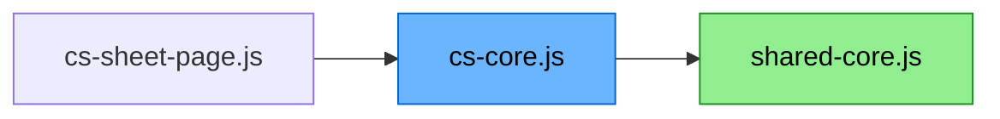
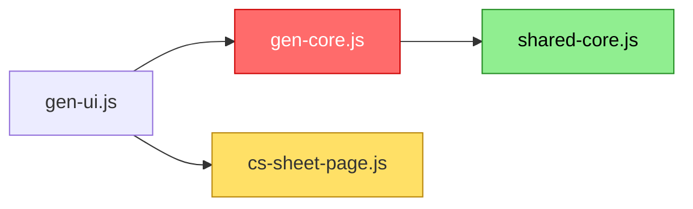

# Module Dependency Flowcharts

Solid arrows = static `import`. Dashed arrows = dynamic `await import(...)`.

**Color key:**
- 🟩 Green = `shared-core.js` (single source of truth, reached via gen-core.js or cs-core.js)
- 🟥 Red = gen-ui.js flow only
- 🟦 Blue = cs-sheet-page.js flow only
- 🟨 Yellow = `cs-sheet-page.js` node in the generator diagram (not expanded there)
- No color = the root entry-point module

> `legacy-utils.js` is a standalone archive module — nothing currently imports from it.
> It is not shown in the diagrams below.

---

## cs-sheet-page.js

---

## gen-ui.js

---

## Dead Code (deleted)

| File | Was | Action |
|------|-----|--------|
| `race-adjustments.js` | Old predecessor to `gen-race-adjustments.js` — never imported | 🗑️ Deleted |
| `test-gygar-data.js` | Developer test script with no HTML entry point | 🗑️ Deleted |
| `gen-race-adjustments.js` | Racial adjustment data — folded into `RACE_INFO.abilityModifiers` in `shared-core.js` | 🗑️ Deleted |
| `gen-0level-gen.js` | Level-0 generator — merged into `gen-core.js` | 🗑️ Deleted |
| `shared-basic-character-gen.js` | Basic mode gen wrappers — replaced by canonical imports | 🗑️ Deleted |
| `shared-advanced-character-gen.js` | Advanced mode gen wrappers — replaced by canonical imports | 🗑️ Deleted |
| `shared-advanced-utils.js` | Advanced utility re-exports + helpers — all functions moved into `shared-core.js` | 🗑️ Deleted |
| `shared-basic-utils.js` | Renamed to `gen-utils.js` (gen-only prefix) | 🗑️ Deleted |
| `shared-generator.js` | Renamed to `gen-core.js`; `gen-names.js` and `gen-backgrounds.js` merged in | 🗑️ Deleted |
| `gen-names.js` | Merged into `gen-core.js` | 🗑️ Deleted |
| `gen-backgrounds.js` | Merged into `gen-core.js` | 🗑️ Deleted |
| `gen-utils.js` | Ability score utility re-exports + DOM helpers — merged into `gen-core.js` | 🗑️ Deleted |
| `gen-equipment.js` | Equipment purchasing logic — merged into `gen-core.js` | 🗑️ Deleted |
| `shared-class-data-shared.js` | CLASS_INFO and table data — inlined into `shared-core.js` | 🗑️ Deleted |
| `shared-class-progression.js` | Class progression helpers — inlined into `shared-core.js` | 🗑️ Deleted |
| `shared-racial-abilities.js` | RACE_INFO and racial helpers — inlined into `shared-core.js` | 🗑️ Deleted |
| `shared-race-names.js` | `LEGACY_RACE_NAMES` / `normalizeRaceName` — inlined into `shared-core.js` | 🗑️ Deleted |
| `shared-abilities.js` | Class/race data + helpers — merged into `shared-core.js` | 🗑️ Deleted |
| `shared-ability-scores.js` | Ability score math — merged into `shared-core.js` | 🗑️ Deleted |
| `shared-hit-points.js` | HP rolling and parsing — merged into `shared-core.js` | 🗑️ Deleted |
| `shared-character.js` | Character creation utilities — merged into `shared-core.js` | 🗑️ Deleted |
| `shared-class-data-ose.js` | OSE-specific class progressions — merged into `shared-core.js` | 🗑️ Deleted |
| `shared-class-data-gygar.js` | Smoothified class progressions — merged into `shared-core.js` | 🗑️ Deleted |
| `shared-class-data-ll.js` | Labyrinth Lord progressions — merged into `shared-core.js` | 🗑️ Deleted |
| `shared-class-data.js` | PROGRESSION_TABLES + re-exports — inlined into `shared-core.js` | 🗑️ Deleted |
| `shared-sheet-builder.js` | Compact-params encoding constants — inlined into `shared-core.js` | 🗑️ Deleted |
| `shared-weapons-and-armor.js` | Weapon and armor data tables — inlined into `shared-core.js` | 🗑️ Deleted |
| `cs-compact-codes.js` | Compact params codec tables and helpers — merged into `cs-core.js` | 🗑️ Deleted |
| `cs-url-codec.js` | Base64-URL gzip encode/decode — merged into `cs-core.js` | 🗑️ Deleted |
| `cs-sheet-renderer.js` | HTML character sheet renderer — merged into `cs-core.js` | 🗑️ Deleted |
| `cs-modifier-display.js` | Ability score modifier display text — merged into `cs-core.js` | 🗑️ Deleted |

---

## Leaf Modules (no imports of their own)

| File | Prefix | Role |
|------|--------|------|
| `shared-core.js` | shared | Everything shared: ability score math, class/race data (CLASS_INFO, RACE_INFO), progression helpers, HP rolling, character creation, weapons/armor data, compact-params encoding constants (PROG_CODE, CLS_CODE, RACE_CODE, RCM_CODE, progModeLabel), and all three mode's progression tables (PROGRESSION_TABLES) |
| `cs-core.js` | cs | All cs-only logic: HTML character sheet renderer, compact params codec, URL codec (gzip/base64), and ability score modifier display (`getModifierEffects`). Re-exports `shared-core.js` so `cs-sheet-page.js` has a single import point. |
| `gen-core.js` | gen | All gen-only logic: DOM helpers, equipment purchasing, name/bg tables, character generator (Basic + Advanced, levels 0–14). Re-exports `shared-core.js` so `gen-ui.js` has a single import point. |
| `legacy-utils.js` | — | Archive of orphaned exports — nothing currently imports from this module |
