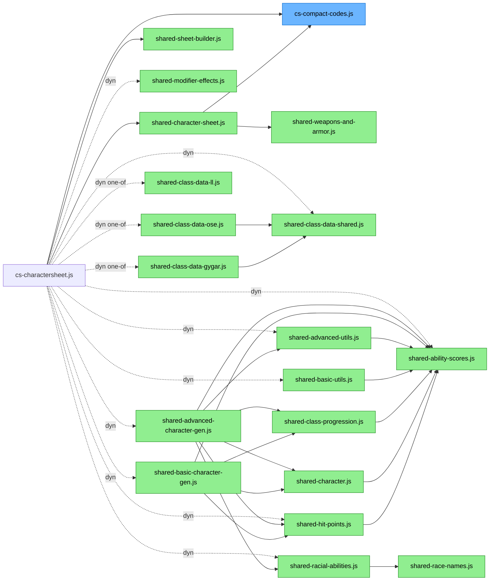
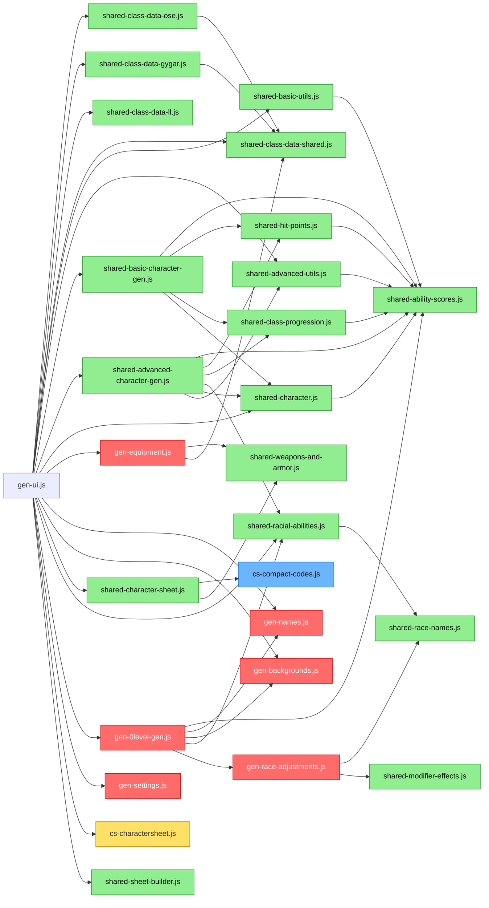

# Module Dependency Flowcharts

Solid arrows = static `import`. Dashed arrows = dynamic `await import(...)`.

**Color key:**
- 🟩 Green = used by **both** cs-charactersheet.js and gen-ui.js
- 🟥 Red = used **only** by gen-ui.js (`gen-` prefix)
- 🟦 Blue = used **only** by cs-charactersheet.js (`cs-` prefix)
- � Yellow = `cs-charactersheet.js` node in the generator diagram (not expanded there)
- No color = the root entry-point module

> `cs-compact-codes.js` is a cs-only file. It appears in the gen-ui.js diagram as a transitive
> dependency (via `shared-character-sheet.js`) but gen-ui.js does not import it directly.
>
> `legacy-utils.js` is a standalone archive module — nothing currently imports from it.
> It is not shown in the diagrams below.

---

## cs-charactersheet.js

---

## gen-ui.js

---

## Dead Code (deleted)

| File | Was | Action |
|------|-----|--------|
| `race-adjustments.js` | Never imported by any JS or HTML file — old predecessor to `gen-race-adjustments.js` | 🗑️ Deleted |
| `test-gygar-data.js` | Developer test script with no HTML entry point | 🗑️ Deleted |

---

## Leaf Modules (no imports of their own)

| File | Prefix | Role |
|------|--------|------|
| `shared-ability-scores.js` | shared | Ability score math (modifiers, XP bonus, roll helpers) |
| `shared-race-names.js` | shared | Race name normalization constants |
| `shared-modifier-effects.js` | shared | Modifier text descriptions |
| `shared-weapons-and-armor.js` | shared | Weapon and armor data tables |
| `shared-class-data-shared.js` | shared | XP tables, HD progressions, spell slots |
| `shared-class-data-ll.js` | shared | LL-specific class data (self-contained) |
| `shared-sheet-builder.js` | shared | Sheet spec builder |
| `cs-compact-codes.js` | cs | URL encoding/decoding of compact params |
| `gen-names.js` | gen | Random name tables |
| `gen-backgrounds.js` | gen | Background/occupation tables |
| `gen-settings.js` | gen | localStorage settings helpers |
| `legacy-utils.js` | — | Archive of orphaned exports — nothing currently imports from this module |
