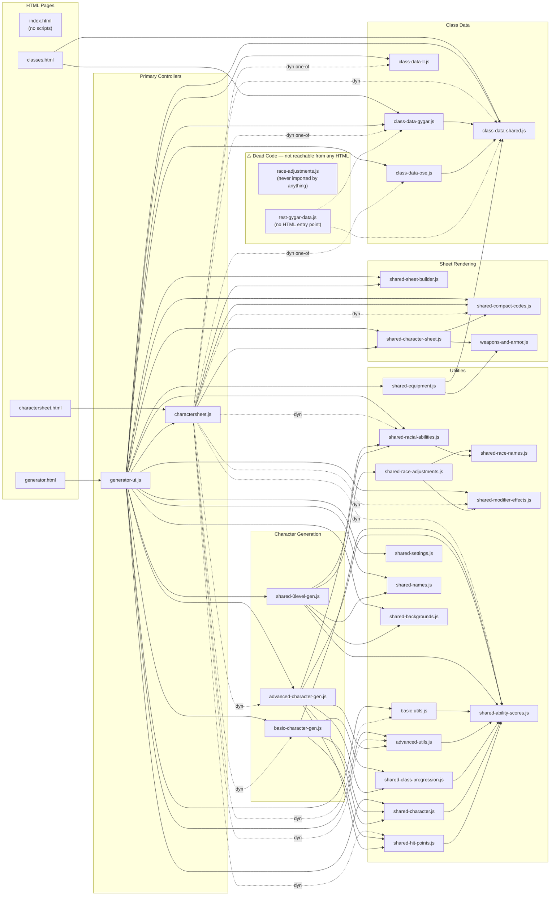

# Module Dependency Flowchart

HTML pages on the left, their JS dependencies flowing right.  
Solid arrows = static `import`. Dashed arrows = dynamic `await import(...)`.

---

## Dead Code Analysis

| File | Status | Reason |
|------|--------|--------|
| `race-adjustments.js` | ⚠️ **Dead** | Never imported by any JS or HTML file. `shared-race-adjustments.js` is the active version; this appears to be an old/renamed predecessor. |
| `test-gygar-data.js` | ⚠️ **Unreachable** | Has no HTML entry point. It's a developer test script only — never loaded by a browser. Could be deleted or moved to a `test/` folder. |
| `index.html` | ℹ️ **No scripts** | Pure static HTML landing page. Links to `generator.html` via `<a>` tags. No JS dependencies. |

---

## Leaf Modules (no imports of their own)

These are pure data/utility modules that nothing imports *from* — they only export:

| File | Role |
|------|------|
| `shared-ability-scores.js` | Ability score math (modifiers, XP bonus, roll helpers) |
| `shared-race-names.js` | Race name normalization constants |
| `shared-modifier-effects.js` | Modifier text descriptions |
| `shared-compact-codes.js` | URL encoding/decoding of compact params |
| `weapons-and-armor.js` | Weapon and armor data tables |
| `class-data-shared.js` | XP tables, HD progressions, spell slots — imported by all three class-data files |
| `class-data-ll.js` | LL-specific class data (no imports — self-contained) |
| `shared-names.js` | Random name tables |
| `shared-backgrounds.js` | Background/occupation tables |
| `shared-settings.js` | localStorage settings helpers |
| `shared-sheet-builder.js` | Sheet spec builder — imported by both controllers |

---

## Single Entry → Both Controllers

`generator.html` → `generator-ui.js` → `charactersheet.js`  
`charactersheet.html` → `charactersheet.js`

Both pages ultimately use `charactersheet.js → expandCompactV2()` as the single sheet-rendering path. The generator just adds character generation and UI on top.
