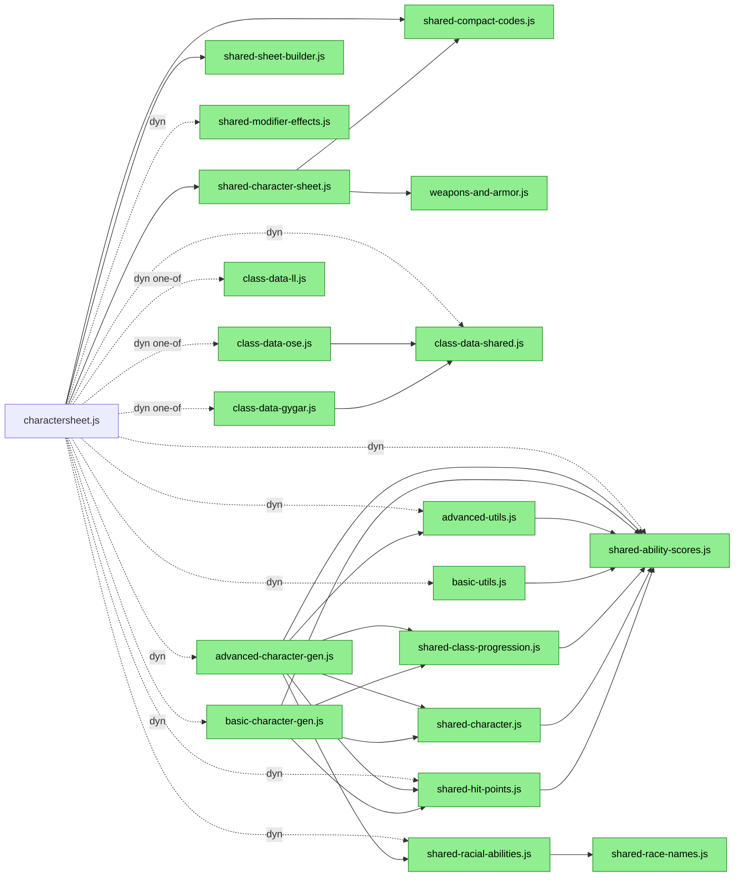
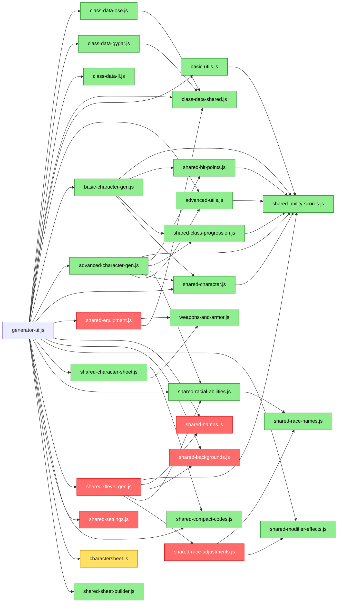

# Module Dependency Flowcharts

Solid arrows = static `import`. Dashed arrows = dynamic `await import(...)`.

**Color key:**
- 🟩 Green = used by **both** charactersheet.js and generator-ui.js
- 🟥 Red = used **only** by generator-ui.js
- 🟨 Yellow = `charactersheet.js` node in the generator diagram (not expanded there)
- No color = the root entry-point module

> Note: every module that `charactersheet.js` uses is *also* directly imported by `generator-ui.js`,
> so there are no charactersheet-only (yellow) leaf modules.

---

## charactersheet.js

---

## generator-ui.js

---

## Dead Code (deleted)

| File | Was | Action |
|------|-----|--------|
| `race-adjustments.js` | Never imported by any JS or HTML file — old predecessor to `shared-race-adjustments.js` | 🗑️ Deleted |
| `test-gygar-data.js` | Developer test script with no HTML entry point | 🗑️ Deleted |

---

## Leaf Modules (no imports of their own)

| File | Role |
|------|------|
| `shared-ability-scores.js` | Ability score math (modifiers, XP bonus, roll helpers) |
| `shared-race-names.js` | Race name normalization constants |
| `shared-modifier-effects.js` | Modifier text descriptions |
| `shared-compact-codes.js` | URL encoding/decoding of compact params |
| `weapons-and-armor.js` | Weapon and armor data tables |
| `class-data-shared.js` | XP tables, HD progressions, spell slots |
| `class-data-ll.js` | LL-specific class data (self-contained) |
| `shared-names.js` | Random name tables |
| `shared-backgrounds.js` | Background/occupation tables |
| `shared-settings.js` | localStorage settings helpers |
| `shared-sheet-builder.js` | Sheet spec builder |
