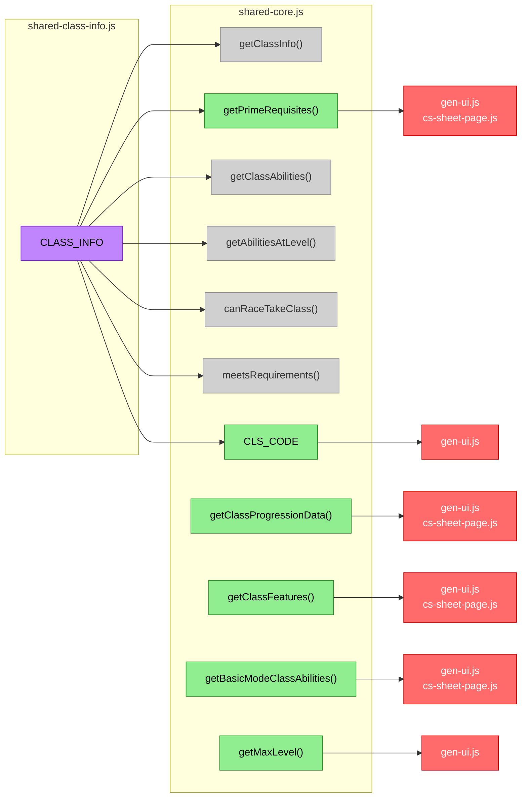
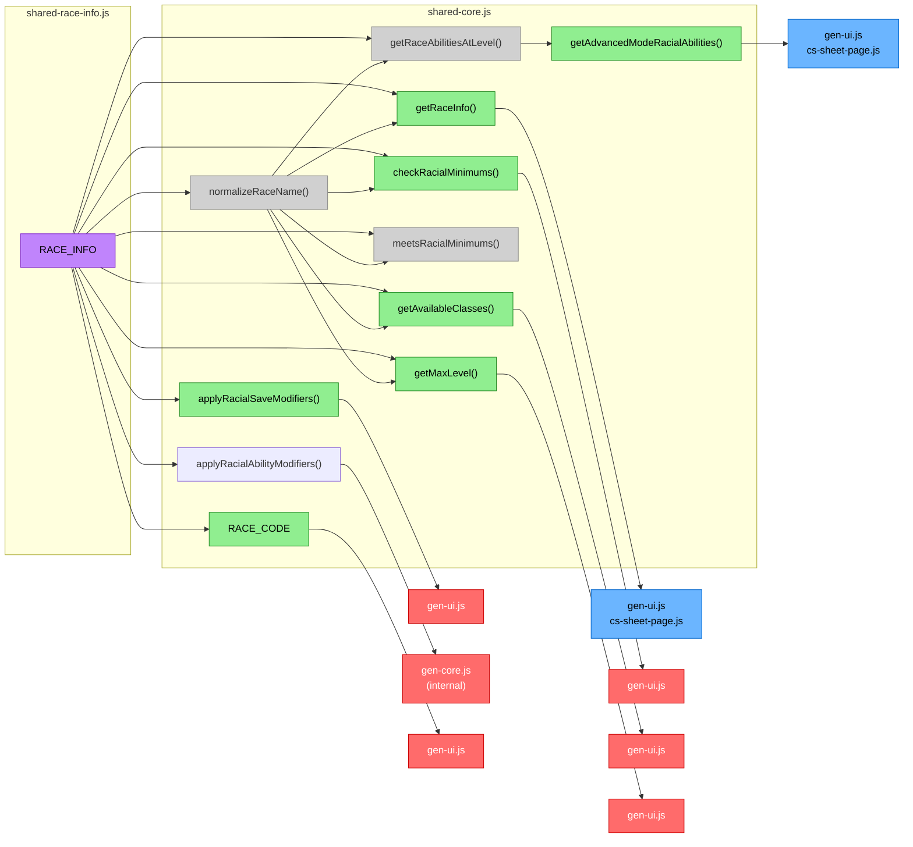
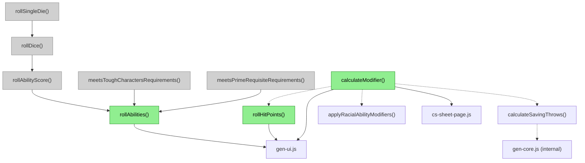
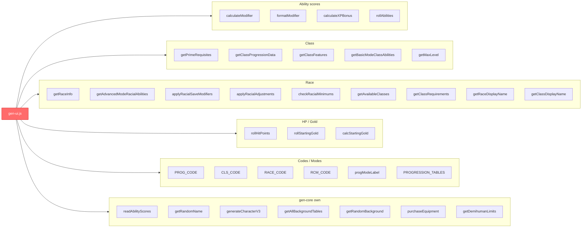
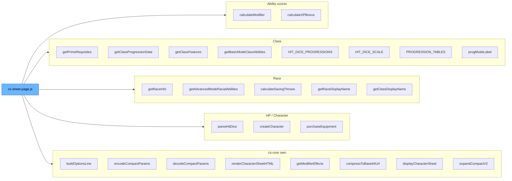
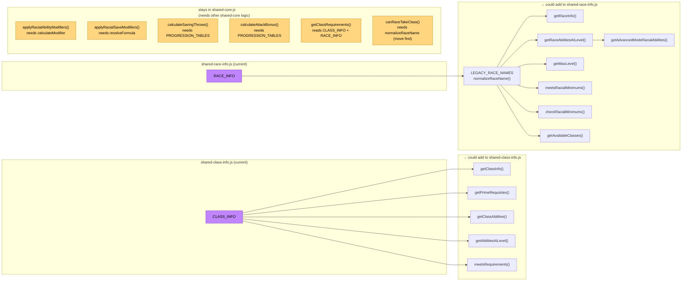

# Function and Constant Flowchart

Detailed dependency graphs showing which functions and constants flow between modules, and
how they depend on each other within `shared-core.js`.

**Color key:**
- 🟪 Purple = data leaf (shared-class-info.js / shared-race-info.js)
- 🟩 Green = shared-core.js
- 🟥 Red = gen-core.js / gen-ui.js
- 🟦 Blue = cs-core.js / cs-sheet-page.js
- ⬜ Grey = internal-only (not called by any controller)

---

## 1. Class data flow

What flows from `CLASS_INFO` through `shared-core.js` to each controller.

---

## 2. Race data flow

What flows from `RACE_INFO` through `shared-core.js` to each controller.

---

## 3. Ability score math — internal call chain

Functions that call other functions within `shared-core.js` before reaching any controller.

---

## 4. gen-ui.js — what it directly names

All identifiers that `gen-ui.js` references by name (sourced from `gen-core.js` re-exports).

---

## 5. cs-sheet-page.js — what it directly names

All identifiers that `cs-sheet-page.js` references by name (sourced from `cs-core.js` re-exports).

---

## 6. Move candidate map

Functions currently in `shared-core.js` that could relocate without creating circular imports.

---

## 7. Dead exports (no callers)

These are exported from `shared-core.js` but referenced by nothing in the project.

| Export | File | Comment |
|--------|------|---------|
| `WEAPON_QUALITIES` | shared-core.js | Weapon tag data — weapon query helpers exist but are also dead |
| `getAllWeaponNames` | shared-core.js | |
| `getAllArmorNames` | shared-core.js | |
| `getWeaponsByQuality` | shared-core.js | |
| `getBluntWeapons` | shared-core.js | |
| `getMeleeWeapons` | shared-core.js | |
| `getMissileWeapons` | shared-core.js | |
| `getTwoHandedWeapons` | shared-core.js | |
| `weaponHasQuality` | shared-core.js | |
| `getWeaponData` | shared-core.js | |
| `getArmorData` | shared-core.js | |
| `getXPToNextLevel` | shared-core.js | Bound into PROGRESSION_TABLES but no direct external caller |
| `getNameTable` | gen-core.js | Name table accessor — unused |
| `getAvailableRaces` | gen-core.js | Race list — unused |
| `showDescriptionAnyway` | shared-race-info.js | Debug toggle — not yet wired to display logic |
